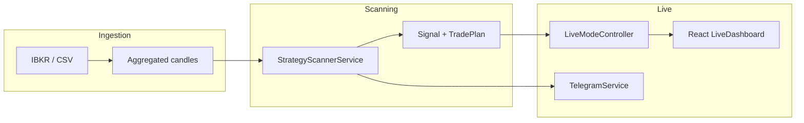
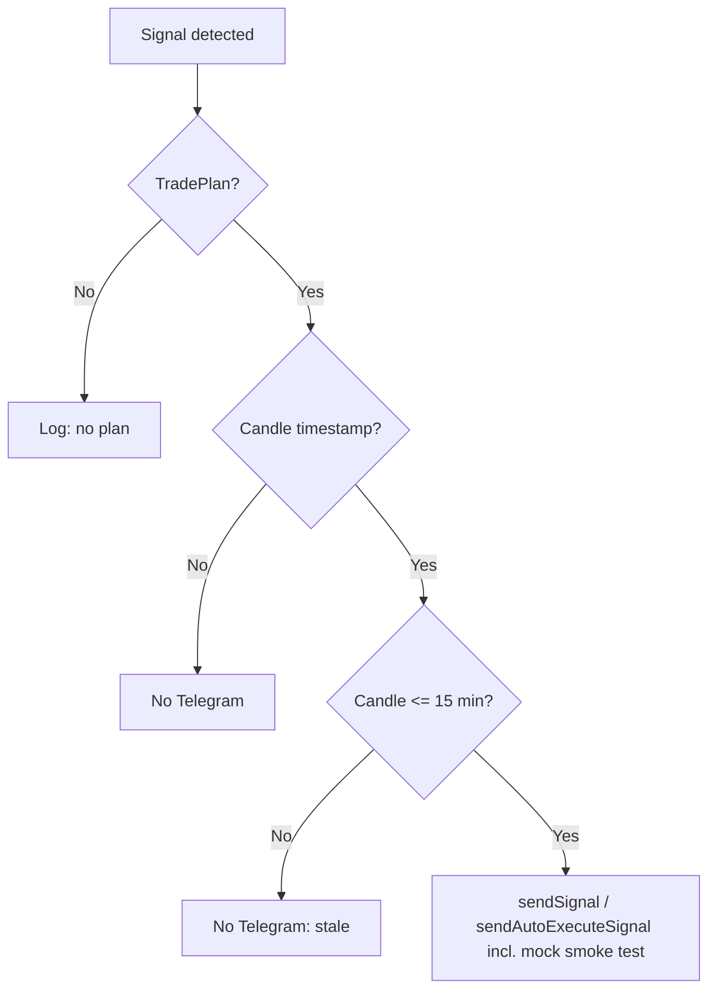
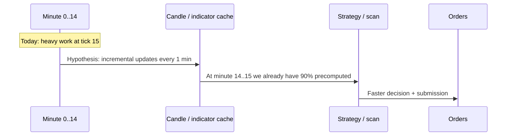

# PRD — Live scan, signals, and execution (Options Quant)

**Version:** 1.0 · **Date:** 2026-04-20 · **Status:** living document (aligned with current code)

## 1. Executive Summary

**Live** mode combines candle downloads, strategy detection over CSV/IBKR, a **signals** list in the UI, manual or automatic **execution** options, **Telegram** notifications, and safeguards for **candle staleness** (15 minutes) and market hours. This document consolidates the behavior observed in code and lists deliberate improvements in **performance**, **reliability**, and **usability**.

## 2. Personas and Goals

| Actor | Goal |
|--------|-------|
| Operator | See clear signals (when found vs entry reference vs exit), delete noise without accidentally closing positions |
| System | Do not execute on stale data; Telegram can include mocks to **test the bot** |
| Developer | Maintain clear boundaries (SOLID: responsibilities per layer; live vs scanner vs IBKR) |

## 3. Current Scope (behavior)

### 3.1 Signal Sources

- **Manual scans** (`POST /live-ui/scan-now`): `StrategyScannerService.scanAll`; replaces rows per ticker while preserving open positions.
- **15m Scheduler** (`MarketScanner`): cron Europe/Madrid; notifies Telegram if there is a plan and a fresh candle (&lt;=15 min); **mocks** also notify for bot smoke tests.
- **Startup** (time window): background scan that adds signals.
- **Mock**: `POST /live-ui/inject-mock-signal` creates a signal with `ZonedDateTime.now()` and calls **`MarketScanner.sendTelegramForScanSignal`** — same branch as cron (for bot smoke testing without waiting for minute 15).

### 3.2 Column mental model (UI)

| Column | Meaning |
|--------|---------|
| **Signal found** | Server timestamp when the row entered / was updated in the live list (`signalFoundAt`). |
| **Entry at** | If an execution is registered: local time of the fill (backend sends HH:mm:ss of current day). If not: **timestamp of the last candle used** (`timestamp` ISO). |
| **Exited at** | Manual/local close with the time of day (combined on client). |

**Important fix:** if the candle timestamp does not arrive, the UI no longer shows the current time as a placeholder (avoids the "everything at 22:00" confusion).

### 3.3 Relevant API

- `GET /live-ui/signals` — includes `signalFoundAt`, `timestamp`, `tradeStatus`, `closedTrades`, etc.
- `DELETE /live-ui/signal?ticker=` — removes row; blocked if there is an open executed position without close.
- `POST /live-ui/signals/clear-stale` — deletes signals with candle &gt;15 min (no open position).
- `POST /live-ui/signals/batch-delete` — JSON `["TICKER",...]` with the same open-position rule.

## 4. Diagrams

### 4.1 High-level flow (live)

### 4.2 Telegram decision (scheduled scan)

### 4.3 Temporal sequence: minute 15 of cycle (opportunity)

## 5. Improvement Opportunities

### 5.1 Performance / latency

| Idea | Benefit | Risk / cost |
|------|---------|-------------|
| **1-min candle delta** between 15m closes | By minute 15, indicators and candidates are already partially updated | More IBKR calls / CPU; needs quotas and clear locks |
| **Prioritized queue HOT &lt; ALL** | Less time to first useful signal | Complexity in scheduler |
| **Per-ticker memoization** within the same scan | Less recalculation of shared features | Discipline needed to invalidate cache on CSV change |

### 5.2 Usability

| Idea | Note |
|------|------|
| Persist **Entry at / Exited at** as ISO instant on server | Avoids "time only" ambiguity across midnight |
| Filters in grid (stale only, executed only) | Reduces visual noise |
| Confirmation modal when **deleting all stale** | There are already grouped destructive actions |

### 5.3 Engineering (SOLID, DRY, reliability)

- **Single responsibility:** `MarketScanner` orchestrates; the "can Telegram be notified?" rule is isolated in `shouldNotifyTelegram` — keep notification policies out of message formatting.
- **Open/closed:** new filtering reasons (e.g. macro bias) can be added without duplicating the Telegram send.
- **DRY:** the "stale > 15 min" rule must follow **a single source** (`isLiveSignalOlderThanMaxAge`) across UI backend, Telegram, and execution.
- **ACID:** live state in memory is **not** transactional; for future auditing, a table/outbox is advisable if strong traceability is required.

## 6. Success Metrics (proposed)

- **Average time** from 15m candle close to first `Signal` persisted in `liveSignals`.
- **Stale signal rate** shown vs corrected by fresh data.
- **Telegram false positives** (count of skips logged vs sent).

## 7. Key Code References

- `com.fgiaquinta.optionsquant.controller.LiveModeController` — live API, `signalFoundAt`, deletion.
- `com.fgiaquinta.optionsquant.service.MarketScanner` — cron, conditional Telegram.
- `frontend/src/pages/LiveDashboard.jsx` — column mapping and staleness.
- `frontend/src/components/LiveTradeGrid.jsx` — table, stale selection, trash icon.

---

## Appendix A — Efficient AI prompts (brief orientation)

1. **Context first:** goal, constraints, stack, and touched files in 5–10 lines.
2. **Expected output:** verifiable list (tests, observable behavior).
3. **Avoid:** "improve the code" without criteria; explicitly request **not** changing files outside the list if applicable.
4. **Iteration:** if the AI hallucinates APIs, paste the real signature or snippet and ask for correction **of that block only**.

## Appendix B — Code mentoring (useful reminder)

- Prefer **explicit data** (`Optional`, null checks at boundaries) over magic defaults (e.g. current time as timestamp).
- Measure before optimizing 1m candles; the bottleneck may be IBKR or CSV disk.
- Regression tests in live controllers when touching stale or Telegram policy.
