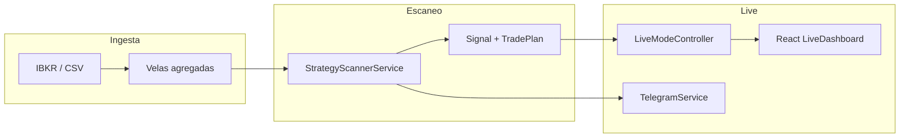
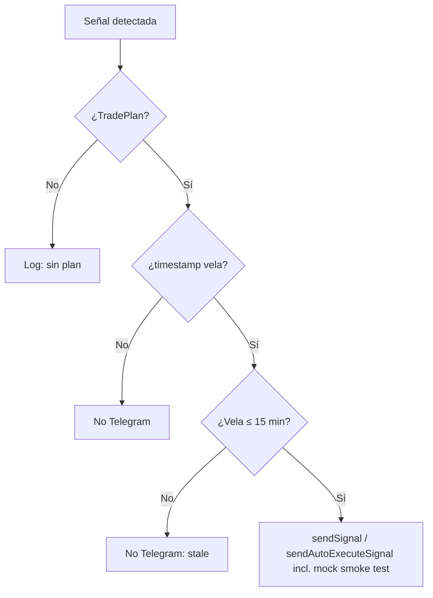
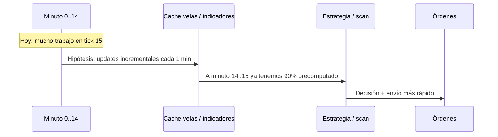

# PRD — Live scan, señales y ejecución (Options Quant)

**Versión:** 1.0 · **Fecha:** 2026-04-20 · **Estado:** documento vivo (alineado al código actual)

## 1. Resumen ejecutivo

El modo **Live** combina descarga de velas, detección de estrategias sobre CSV/IBKR, una lista de **señales** en UI, opciones de **ejecución** manual o automática, notificaciones **Telegram**, y salvaguardas por **antigüedad de la vela** (15 minutos) y horario de mercado. Este documento consolida el comportamiento observado en código y lista mejoras deliberadas en **rendimiento**, **confiabilidad** y **usabilidad**.

## 2. Personas y objetivos

| Actor | Objetivo |
|--------|-----------|
| Operador | Ver señales claras (cuándo se encontró vs referencia de entrada vs salida), borrar ruido sin cerrar posiciones por error |
| Sistema | No ejecutar sobre datos obsoletos; Telegram puede incluir mocks para **probar el bot** |
| Desarrollador | Mantener límites claros (SOLID: responsabilidades por capa; live vs scanner vs IBKR) |

## 3. Alcance actual (comportamiento)

### 3.1 Fuentes de señales

- **Escaneos manuales** (`POST /live-ui/scan-now`): `StrategyScannerService.scanAll`; reemplaza filas por ticker conservando posiciones abiertas.
- **Scheduler 15m** (`MarketScanner`): cron Europa/Madrid; notifica Telegram si hay plan y vela fresca (&lt;=15 m); los **mock** también notifican para smoke tests del bot.
- **Arranque** (ventana horaria): escaneo en background que añade señales.
- **Mock**: `POST /live-ui/inject-mock-signal` crea una señal con `ZonedDateTime.now()` y llama a **`MarketScanner.sendTelegramForScanSignal`** — misma rama que el cron (para smoke test del bot sin esperar al minuto 15).

### 3.2 Modelo mental de columnas (UI)

| Columna | Significado |
|---------|-------------|
| **Signal found** | Reloj servidor cuando la fila entró / se actualizó en la lista live (`signalFoundAt`). |
| **Entry at** | Si hay ejecución registrada: hora local del fill (backend envía HH:mm:ss del día actual). Si no: **marca de tiempo de la última vela usada** (`timestamp` ISO). |
| **Exited at** | Cierre manual/local con hora del día (combinada en cliente). |

**Corrección importante:** si el timestamp de vela no llega, la UI ya **no** muestra la hora actual como placeholder (evita la confusión “todo a las 22:00”).

### 3.3 API relevante

- `GET /live-ui/signals` — incluye `signalFoundAt`, `timestamp`, `tradeStatus`, `closedTrades`, etc.
- `DELETE /live-ui/signal?ticker=` — quita fila; bloqueado si hay posición abierta ejecutada sin cierre.
- `POST /live-ui/signals/clear-stale` — elimina señales con vela &gt;15 m (sin posición abierta).
- `POST /live-ui/signals/batch-delete` — JSON `["TICKER",...]` con la misma regla de posición abierta.

## 4. Diagramas

### 4.1 Flujo alto nivel (live)

### 4.2 Decisión Telegram (scheduled scan)

### 4.3 Secuencia temporal: minuto 15 del ciclo (oportunidad)

## 5. Oportunidades de mejora

### 5.1 Rendimiento / latencia

| Idea | Beneficio | Riesgo / coste |
|------|-----------|----------------|
| **Delta de velas cada 1 min** entre cierres 15m | Al llegar el minuto 15, indicadores y candidatos ya parcialmente actualizados | Más llamadas IBKR / CPU; necesita cuotas y locks claros |
| **Cola priorizada HOT &lt; ALL** | Menos tiempo hasta primera señal útil | Complejidad en scheduler |
| **Memoización por ticker** dentro del mismo scan | Menos recálculo de features compartidas | Disciplina para invalidar cache al cambiar CSV |

### 5.2 Usabilidad

| Idea | Nota |
|------|------|
| Persistir **Entry at / Exited at** como instant ISO en servidor | Evita ambigüedad “solo hora” en cruces de medianoche |
| Filtros en grid (solo stale, solo ejecutadas) | Reduce ruido visual |
| Confirmación modal al **borrar todas las stale** | Ya hay acciones destructivas agrupadas |

### 5.3 Ingeniería (SOLID, DRY, fiabilidad)

- **Single responsibility:** `MarketScanner` orquesta; la regla “¿se puede notificar Telegram?” está aislada en `shouldNotifyTelegram` — mantener políticas de notificación fuera del formateo de mensajes.
- **Open/closed:** nuevas razones de filtrado (p. ej. sesgo macro) pueden extenderse sin duplicar el envío Telegram.
- **DRY:** la regla “stale &gt; 15 min” debe seguir **una sola fuente** (`isLiveSignalOlderThanMaxAge`) en UI backend, Telegram y ejecución.
- **ACID:** el estado live en memoria **no** es transaccional; para auditoría futura conviene tabla/outbox si se requiere trazabilidad fuerte.

## 6. Métricas de éxito (propuestas)

- **Tiempo medio** desde cierre de vela 15m hasta primer `Signal` persistido en `liveSignals`.
- **Tasa de señales stale** mostradas vs corregidas por datos frescos.
- **Falsos positivos Telegram** (count de skips logueados vs enviados).

## 7. Referencias de código clave

- `com.fgiaquinta.optionsquant.controller.LiveModeController` — API live, `signalFoundAt`, borrado.
- `com.fgiaquinta.optionsquant.service.MarketScanner` — cron, Telegram condicionado.
- `frontend/src/pages/LiveDashboard.jsx` — mapeo de columnas y antigüedad.
- `frontend/src/components/LiveTradeGrid.jsx` — tabla, selección stale, papelera.

---

## Apéndice A — Prompts eficientes para IA (orientación breve)

1. **Contexto primero:** objetivo, restricciones, stack y archivos tocados en 5–10 líneas.
2. **Salida esperada:** lista verificable (tests, comportamiento observable).
3. **Evitar:** “mejora el código” sin criterio; pedir explícitamente **no** cambiar ficheros fuera de lista si aplica.
4. **Iteración:** si la IA alucina APIs, pegar firma real o snippet y pedir corrección **solo** de ese bloque.

## Apéndice B — Mentoría código (recordatorio útil)

- Preferir **datos explícitos** (`Optional`, null checks en fronteras) a defaults mágicos (p. ej. hora actual como timestamp).
- Medir antes de optimizar velas 1m; el cuello puede ser IBKR o disco CSV.
- Tests de regresión en controladores live cuando se toque política de stale o Telegram.
